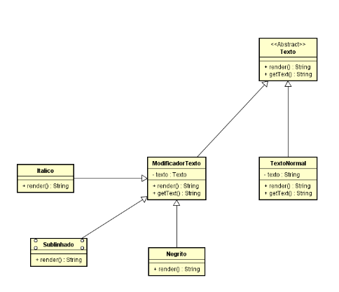

# Exercício 03 - Software de Textos e usando o padrão Decorator

## Aluno: Henrick de Sousa Nogueira

## 📚 Descrição

- O problema proposto envolve a criação de um sistema para representar textos com diferentes estilos gráficos, como negrito, itálico e sublinhado, de forma que essas modificações possam ser combinadas dinamicamente. Cada palavra pode ser apresentada com diferentes formatos, e a solução deve permitir adicionar ou remover esses estilos de forma flexível, sem a necessidade de criar várias subclasses para cada combinação de estilos.

- A solução foi implementada utilizando o padrão Decorator, que permite adicionar novos comportamentos a objetos de maneira dinâmica. Criamos uma classe base Texto, que representa o texto simples, e classes Decorator como Negrito, Italico e Sublinhado, que envolvem o texto e aplicam o estilo correspondente. Esse padrão facilita a combinação de múltiplos estilos ao compor decoradores de forma modular.

- O uso do Decorator é ideal nesse caso, pois ele oferece flexibilidade para aplicar diferentes formatações sem a complexidade de criar subclasses para cada combinação de estilo, mantendo o código simples, escalável e fácil de manter

## 🛠 Tecnologias

-  [Java](https://www.java.com/pt-BR)